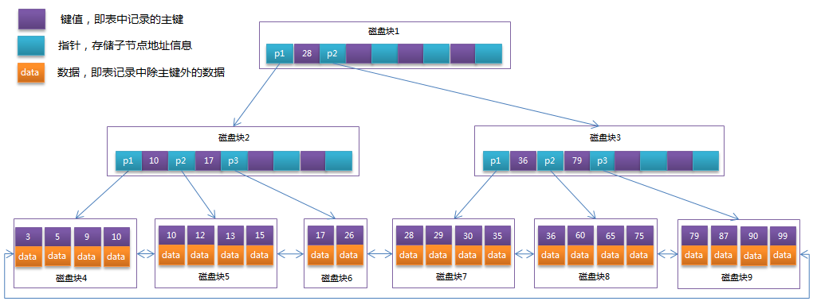

# Mysql

## 一.索引
###  1.索引数据结构
#### 1.1 B+ Tree原理
* B- Tree

* B+ Tree

基于图示的数据结构，可以利用磁盘的预读性

#### 1.2 为什么B+树比B树更适合作为索引
1. B+树的磁盘读写代价更低：B+树的内部节点并没有指向关键字具体信息的指针，因此其内部节点相对B树更小，如果把所有同一内部节点的关键字存放在同一盘块中，那么盘块所能容纳的关键字数量也越多，一次性读入内存的需要查找的关键字也就越多，相对IO读写次数就降低了。

2. B+树的查询效率更加稳定：由于非终结点并不是最终指向文件内容的结点，而只是叶子结点中关键字的索引。所以任何关键字的查找必须走一条从根结点到叶子结点的路。所有关键字查询的路径长度相同，导致每一个数据的查询效率相当。

3. 由于B+树的数据都存储在叶子结点中，分支结点均为索引，方便扫库，只需要扫一遍叶子结点即可，但是B树因为其分支结点同样存储着数据，我们要找到具体的数据，需要进行一次中序遍历按序来扫，所以B+树更加适合在区间查询的情况，所以通常B+树用于数据库索引。

4. B树在提高了IO性能的同时并没有解决元素遍历的我效率低下的问题，正是为了解决这个问题，B+树应用而生。B+树只需要去遍历叶子节点就可以实现整棵树的遍历。而且在数据库中基于范围的查询是非常频繁的，而B树不支持这样的操作或者说效率太低。

参考资料：<br>
[1][为什么MySQL数据库索引选择使用B+树？](https://www.cnblogs.com/tiancai/p/9024351.html)

### 2. 索引特点
#### 2.1 联合索引
* 联合索引的优点
   * 减少开销。建一个联合索引(col1,col2,col3)，实际相当于建了(col1),(col1,col2),(col1,col2,col3)三个索引。每多一个索引，都会增加写操作的开销和磁盘空间的开销。对于大量数据的表，使用联合索引会大大的减少开销
   * 覆盖索引。对联合索引(col1,col2,col3)，如果有如下的sql: select col1,col2,col3 from test where col1=1 and col2=2。那么MySQL可以直接通过遍历索引取得数据，而无需回表，这减少了很多的随机io操作。减少io操作，特别的随机io其实是dba主要的优化策略。所以，在真正的实际应用中，覆盖索引是主要的提升性能的优化手段之一
   * 效率高。索引列越多，通过索引筛选出的数据越少。有1000W条数据的表，有如下sql:select from table where col1=1 and col2=2 and col3=3,假设假设每个条件可以筛选出10%的数据，如果只有单值索引，那么通过该索引能筛选出1000W10%=100w条数据，然后再回表从100w条数据中找到符合col2=2 and col3= 3的数据，然后再排序，再分页；如果是联合索引，通过索引筛选出1000w10% 10% *10%=1w，效率提升可想而知！

* 联合索引原则
   1. 最左前缀匹配原则，非常重要的原则，mysql会一直向右匹配直到遇到范围查询(>、<、between、like（一般情况下不鼓励使用like操作，如果非使用不可，如何使用也是一个问题。like “%aaa%” 不会使用索引而like “aaa%”可以使用索引))就停止匹配(即后面不能用索引)，比如a = 1 and b = 2 and c > 3 and d = 4 如果建立(a,b,c,d)顺序的索引，d是用不到索引的，如果建立(a,b,d,c)的索引则都可以用到，a,b,d的顺序可以任意调整。

   2. =和in可以乱序，比如a = 1 and b = 2 and c = 3 建立(a,b,c)索引可以任意顺序，mysql的查询优化器会帮你优化成索引可以识别的形式。

   3. 尽量选择区分度高的列作为索引，区分度的公式是count(distinct col)/count(*)，表示字段不重复的比例，比例越大我们扫描的记录数越少，唯一键的区分度是1，而一些状态、性别字段可能在大数据面前区分度就是0，那可能有人会问，这个比例有什么经验值吗？使用场景不同，这个值也很难确定，一般需要join的字段我们都要求是0.1以上，即平均1条扫描10条记录。

   4. 查询中有某个列的范围查询，则其右边所有列都无法使用索引优化查找


* 疑问
   ```
   对于联合索引(col1,col2,col3)，查询语句SELECT * FROM test WHERE col2=2;是否能够触发索引？
   大多数人都会说NO，实际上却是YES
   原因：
      EXPLAIN SELECT * FROM test WHERE col2=2;
      EXPLAIN SELECT * FROM test WHERE col1=1;
   观察上述两个explain结果中的type字段。查询中分别是：
   ```

#### 2.2 前缀索引
* 如果频繁按名字搜索员工，这样显然效率很低，因此我们可以考虑建索引。有两种选择，建<first_name>或<first_name, last_name>，看下两个索引的选择性：<first_name>显然选择性太低，<first_name, last_name>选择性很好，但是first_name和last_name加起来长度为30，有没有兼顾长度和选择性的办法？可以考虑用first_name和last_name的前几个字符建立索引，例如<first_name, left(last_name, 3)>
* 有时候需要索引很长的字符列，这会让索引变得大且慢。通常可以索引开始的部分字符，这样可以大大节约索引空间，从而提高索引效率。
* 一般情况下某个前缀的选择性也是足够高的，足以满足查询性能。对于BLOB，TEXT，或者很长的VARCHAR类型的列，必须使用前缀索引，因为MySQL不允许索引这些列的完整长度。
* 前缀索引一般只能用于普通索引当中,不能使用在unique当中,如果强行unique中索引有可能无法被使用上
```Mysql
alter table xw_user_applyloan add index uname( old_kefuid(4) )
```

#### 2.3 哈希索引
* 哈希索引值包含哈希值和指针
* 哈希索引只支持等比较查询

#### 2.4 全文索引
* 5.6版后的InnoDB引擎也加入了全文索引，5.7版本之后通过使用ngram插件开始支持中文
* 全文索引的三种类型
   1. 自然语言搜索将搜索字符串解释为自然语言中短语。
   2. 布尔全文搜索
   3. 查询扩展搜索

#### 2.5 覆盖索引
* [覆盖索引](https://www.cnblogs.com/happyflyingpig/p/7662881.html)

#### 2.6 为什么索引可以用于order by和group by操作
* [group by和order by本质都是排序](https://www.cnblogs.com/moss_tan_jun/p/6021822.html)

#### 2.7 索引失效
* [索引失效](https://www.cnblogs.com/shynshyn/p/7887742.html)

参考资料：<br>
[1][Mysql索引详解(个人觉得讲的很好，必看 )](http://blog.codinglabs.org/articles/theory-of-mysql-index.html)
[2][mysql索引原理(这个也很好，必看)](https://www.cnblogs.com/Eva-J/articles/10126413.html)

#### 2.8 [mysql 中UNIQUE KEY 到底是约束还是索引](https://blog.csdn.net/freehappyness/article/details/78501159)

### MySQL引擎
#### 3.1. MyISAM
* MyISAM只有表级锁，因此Update时会锁表，delete，insert，delete都不能运行


#### 3.2.InnoDB


* [InnoDB的主键选择与插入优化](https://www.jianshu.com/p/1203fd140cc2)<br>
在使用InnoDB存储引擎时，如果没有特别的需要，请永远使用一个与业务无关的自增字段作为主键。

* 主键：如果在创建表时没有显式地定义主键,则InnoDB存储引擎会按如下方式选择或创建主键:
   1. 首先判断表中是否有非空的唯一索引,如果有,则该列即为主键.
   2. 如果不符合上述条件,InnoDB存储引擎自动创建一个6字节大小的指针.

* [主索引、辅助索引](https://www.jianshu.com/p/642bc306b1d9)
* [聚簇索引](https://blog.csdn.net/u013132035/article/details/82193763)

#### 3.3.MySQL三大引擎
[InnoDB, MyISAM和Memory](https://cloud.tencent.com/developer/article/1347090)<br>
[InnoDB和MyISAM区别](https://www.runoob.com/w3cnote/mysql-different-nnodb-myisam.html)